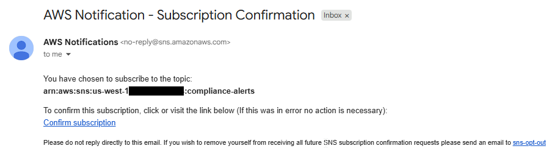
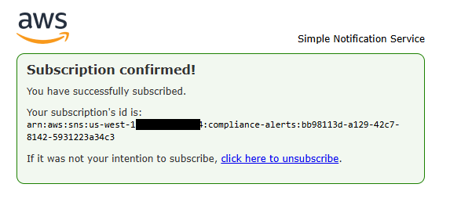
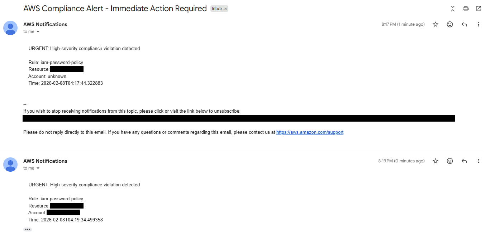

# AWS Config Compliance Monitor

Continuous compliance monitoring that detects configuration drift, logs audit-ready evidence, and auto-remediates violations. Built for CJIS Security Policy and FedRAMP High requirements.

## Architecture Overview

This system implements continuous compliance monitoring using AWS Config managed rules, with event-driven alerting and automated remediation. AWS Config evaluates resources against three rules (S3 encryption, security group ingress, IAM password policy). When a resource transitions to NON_COMPLIANT, EventBridge routes the compliance change event to a Lambda function that classifies severity, logs structured audit evidence to CloudWatch, and sends SNS email alerts for HIGH-severity findings. Config remediation actions invoke SSM Automation documents to restore non-compliant resources to their expected state, and Config re-evaluates to confirm compliance.

```
AWS Config --> EventBridge --> Lambda --> CloudWatch Logs (audit evidence)
                                     --> SNS (email alerts)
           --> SSM Automation (auto-remediation)
```

## Screenshots

**SNS subscription confirmation email** - After creating the SNS topic and subscribing an email endpoint, AWS sends a confirmation request.



**Subscription confirmed** - Clicking the confirmation link activates the subscription for compliance alerts.



**Compliance alert emails** - When the IAM password policy is deliberately broken, EventBridge triggers Lambda, which classifies the violation as HIGH severity and publishes to SNS. The email shows the structured alert with rule name, resource, account, and timestamp.



## AWS Services Used

| Service | Role |
|---|---|
| AWS Config | Continuously evaluates resource configurations against managed rules |
| AWS Config Remediation | Triggers SSM Automation to restore non-compliant resources |
| EventBridge | Routes NON_COMPLIANT compliance change events to Lambda |
| Lambda | Classifies severity, logs structured audit evidence, sends SNS alerts |
| SNS | Delivers email notifications for HIGH-severity violations |
| SSM (Systems Manager) | Executes automation documents to remediate non-compliant resources |
| CloudFormation | Deploys Config rules, remediation configurations, and IAM roles as IaC |
| IAM | Provides least-privilege execution roles for Lambda and SSM |
| CloudWatch Logs | Stores structured compliance violation logs as audit evidence |
| S3 | Stores Config configuration snapshots and delivery channel data |
| CloudTrail | Provides API activity logging that underpins Config's change detection |

## Config Rules Deployed

| Rule | Purpose |
|---|---|
| `s3-bucket-server-side-encryption-enabled` | Enforces server-side encryption on all S3 buckets |
| `ec2-security-group-attached-to-eni-periodic` | Detects security groups with unrestricted ingress |
| `iam-password-policy` | Enforces password complexity, length, and rotation |

## Controls Mapping

### NIST 800-53 Rev. 5

| Control ID | Control Name | How This Project Satisfies It |
|---|---|---|
| SI-4 | System Monitoring | EventBridge + Lambda provide real-time monitoring of compliance state changes across evaluated resources |
| SI-7 | Software, Firmware, and Information Integrity | Config rules continuously validate that resource configurations have not drifted from their expected baseline |
| AU-6 | Audit Record Review, Analysis, and Reporting | Lambda writes structured JSON audit logs to CloudWatch; SNS alerts surface HIGH-severity findings for immediate review |
| CM-2 | Baseline Configuration | CloudFormation templates define the expected resource configuration baseline; Config evaluates against it |
| CM-6 | Configuration Settings | Config managed rules enforce organization-defined configuration settings (encryption, password policy, network access) |
| IA-5 | Authenticator Management | IAM password policy rule enforces 14-character minimum, complexity requirements, and 90-day rotation |
| SC-28 | Protection of Information at Rest | S3 encryption rule ensures server-side encryption is enabled on all buckets |
| SC-7 | Boundary Protection | Security group rule detects unrestricted ingress, and SSM remediation removes unauthorized access |

### FedRAMP High

FedRAMP High baseline inherits all NIST 800-53 Rev. 5 controls listed above. This implementation directly supports FedRAMP High authorization by enforcing continuous configuration monitoring, automated remediation, and structured audit logging. The event-driven architecture aligns with FedRAMP's continuous monitoring requirements: compliance state is evaluated in near real-time, violations are automatically surfaced and remediated, and audit evidence is retained in CloudWatch Logs.

### CJIS Security Policy v6.0

CJIS v6.0 (released December 2024) restructured the policy from 13 to 20 policy areas and aligned with NIST SP 800-53 Rev. 5. The table below maps this project's controls to the v6.0 policy area structure.

| Policy Area | Requirement | How This Project Addresses It |
|---|---|---|
| Policy Area 4: Auditing and Accountability | Audit event logging and review | Lambda writes structured JSON audit records to CloudWatch Logs for every compliance violation, providing tamper-evident audit evidence |
| Policy Area 5: Access Control | Least privilege and access enforcement | Lambda and SSM execution roles follow least-privilege principles; IAM roles are scoped to only the actions required for remediation |
| Policy Area 6: Identification and Authentication | Password standards enforcement | IAM password policy remediation enforces 14-character minimum, uppercase/lowercase/number/symbol complexity, and 90-day rotation, satisfying CJIS v6.0 Basic Password Standards |
| Policy Area 10: Systems and Communications Protection | Encryption at rest and network segmentation | S3 encryption rule enforces server-side encryption; security group rule detects and remediates unrestricted network ingress |
| Assessment, Authorization & Monitoring | Continuous monitoring | Event-driven architecture evaluates compliance continuously and remediates automatically, supporting CJIS's continuous monitoring mandate |

The password policy remediation (14-character minimum, complexity requirements, 90-day rotation) satisfies CJIS v6.0 Basic Password Standards. CJIS v6.0 also defines Advanced Standards (20-character minimum, banned password list) as a higher tier, which represents a path for future enhancement.

## Bugs Found and Fixed

Six bugs were found and fixed during implementation. These bugs existed in the original lab code and were identified through testing and debugging.

### Lambda Function (compliance_violation_logger.py)

| Bug | Symptom | Fix |
|---|---|---|
| `os.environ('SNS_TOPIC_ARN')` uses parentheses | Lambda crashes with `TypeError: '_Environ' object is not callable` | Changed to `os.environ['SNS_TOPIC_ARN']` (square brackets) |
| `TopicArn='SNS_TOPIC_ARN'` passes a string literal | SNS publish targets a nonexistent topic ARN | Changed to `TopicArn=SNS_TOPIC_ARN` (variable reference, no quotes) |
| `determine_severity()` only checks rules not deployed in this lab | All violations classify as MEDIUM; no SNS alerts fire | Added `s3-bucket-server-side-encryption-enabled`, `ec2-security-group-attached-to-eni-periodic`, and `iam-password-policy` to the HIGH severity list |

### IAM Password Policy Template (remediation-iam-password-policy.yaml)

| Bug | Symptom | Fix |
|---|---|---|
| `StaticValue` uses string shorthand (`StaticValue: '14'`) | CloudFormation rejects with type mismatch | Changed to `StaticValue: Values: ['14']` array format |
| Missing `MaximumAutomaticAttempts` and `RetryAttemptSeconds` | CloudFormation fails with `InvalidParameterValueException` when `Automatic: true` | Added `MaximumAutomaticAttempts: 3` and `RetryAttemptSeconds: 60` |
| Boolean parameters use Python casing (`'True'`) | SSM remediation fails: "The value supplied for RequireLowercaseCharacters is not a valid Boolean" | Changed all booleans to lowercase `'true'` |

## Deployment

### Prerequisites

- AWS account with AWS Config recorder active
- AWS CLI configured with appropriate permissions
- An SNS topic created with a confirmed email subscription

### Steps

1. **Deploy the Lambda execution role:**
   ```bash
   aws cloudformation deploy \
     --template-file cloudformation/lambda-execution-role.yaml \
     --stack-name compliance-lambda-role \
     --capabilities CAPABILITY_IAM
   ```

2. **Package and deploy the Lambda function:**
   ```bash
   zip compliance_violation_logger.zip lambda/compliance_violation_logger.py
   aws lambda create-function \
     --function-name ComplianceViolationLogger \
     --runtime python3.12 \
     --handler compliance_violation_logger.lambda_handler \
     --role <LambdaExecutionRoleArn> \
     --zip-file fileb://compliance_violation_logger.zip \
     --environment Variables={SNS_TOPIC_ARN=<your-sns-topic-arn>}
   ```

3. **Create an EventBridge rule targeting the Lambda function:**
   ```bash
   aws events put-rule \
     --name config-compliance-change \
     --event-pattern '{"source":["aws.config"],"detail-type":["Config Rules Compliance Change"],"detail":{"newEvaluationResult":{"complianceType":["NON_COMPLIANT"]}}}'

   aws events put-targets \
     --rule config-compliance-change \
     --targets "Id"="1","Arn"="<LambdaFunctionArn>"

   aws lambda add-permission \
     --function-name ComplianceViolationLogger \
     --statement-id EventBridgeInvoke \
     --action lambda:InvokeFunction \
     --principal events.amazonaws.com \
     --source-arn <EventBridgeRuleArn>
   ```

4. **Deploy the three Config remediation stacks:**
   ```bash
   aws cloudformation deploy \
     --template-file cloudformation/remediation-s3-encryption.yaml \
     --stack-name config-remediation-s3-encryption \
     --capabilities CAPABILITY_IAM

   aws cloudformation deploy \
     --template-file cloudformation/remediation-security-group.yaml \
     --stack-name config-remediation-security-group \
     --capabilities CAPABILITY_IAM

   aws cloudformation deploy \
     --template-file cloudformation/remediation-iam-password-policy.yaml \
     --stack-name config-remediation-iam-password-policy \
     --capabilities CAPABILITY_IAM
   ```

5. **Test with IAM password policy:** Set a compliant password policy, then break it (e.g., reduce minimum length). Verify the EventBridge event fires, Lambda logs the violation, SNS sends an alert, and SSM auto-remediation restores the compliant policy.

## Testing Notes

- **S3 encryption rule:** All new S3 buckets are COMPLIANT by default since AWS enforces SSE-S3 (January 2024). This rule acts as a guardrail and cannot be demonstrated by simply creating a new bucket.
- **Security group rule:** This is a periodic rule that only evaluates security groups attached to ENIs. Unattached security groups are not evaluated.
- **IAM password policy:** The most reliable test target. Requires a COMPLIANT to NON_COMPLIANT state transition to trigger EventBridge. Set a compliant policy first, then deliberately break a parameter to trigger the full event chain.

## Cleanup

Remove all deployed resources in reverse order:

```bash
aws cloudformation delete-stack --stack-name config-remediation-iam-password-policy
aws cloudformation delete-stack --stack-name config-remediation-security-group
aws cloudformation delete-stack --stack-name config-remediation-s3-encryption

aws events remove-targets --rule config-compliance-change --ids "1"
aws events delete-rule --name config-compliance-change

aws lambda delete-function --function-name ComplianceViolationLogger

aws cloudformation delete-stack --stack-name compliance-lambda-role
```

## Based On

This project is based on Chapter 6 ("Event-Driven Architecture for GRC Engineers") of [GRC Engineering in AWS (V2)](https://github.com/ajy0127/thegrcengineeringbook) by AJ Yawn.
